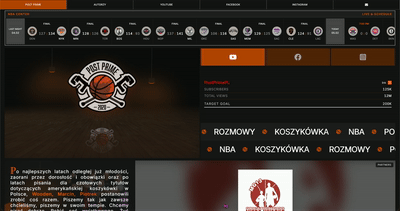
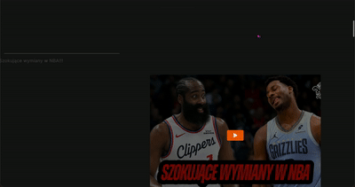
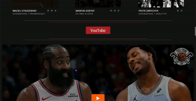

# 🏀 Post Prime — Automated Basketball Content Hub

 (open in new tab)

A high-performance, fully automated content aggregator built for a leading Polish basketball podcast. This project shifts the paradigm from a static website to an intelligent **content pipeline**, unifying social media feeds and live sports data in one place with zero manual maintenance required.

> **Status:** Project currently in the final client evaluation and API integration phase.

## 🚀 Features

- 🤖 **Automated Content Pipeline** — Synchronizes latest videos via **YouTube API** without any manual input.
- 📊 **NBA Live Scoreboard** — Real-time game tracking using official **NBA CDN data** with custom **rollover logic** for time-sensitive schedules.
- ⚡ **Extreme Performance** — Highly optimized architecture delivering **99% Performance** on Desktop and **98%** on Mobile.
- 🍱 **Magazine Dashboard** — A modern, high-density layout designed to aggregate multiple social media streams (YT, FB, IG).
- 🔄 **Scroll-Driven Animation** — Interactive elements including a basketball rotation logic tied to user scroll position.
- 📱 **Fully Responsive** — Seamless experience across all devices, from mobile to ultra-wide monitors.

---

## 🛠️ Tech Stack

- **Next.js 15** (App Router)
- **TypeScript**
- **Tailwind CSS** 
- **Motion** (motion/react)
- **YouTube Data API v3**
- **NBA CDN** (Real-time data)

---
## 🏠 Project Sections

### 🏠 Hero Home Page

The landing experience featuring the live NBA scoreboard, dynamic stats, and the main visual identity of the brand.*

### 📰 Last News (Info Bar)

A high-visibility automated section that highlights the most recent updates and site-wide notifications using custom typography animations.*

### 🏀 About Section

The brand's bio featuring interactive scroll-based animations where background assets (basketball) react to user movement.*

### 📺 YouTube Feed (YT List)

An automated list of the latest 10 podcast episodes fetched directly via YouTube API, ensuring the site is always up-to-date.*

---

## 🛠️ Implementation Highlights

- **Custom Rollover System:** Engineered a date-parsing utility to align US game times with European timezones, ensuring the scoreboard stays relevant.
- **Variant Propagation:** Optimized animations using parent-child inheritance in Framer Motion for synchronized "WhileInView" entry effects.
- **CDN Data Fetching:** Efficiently handling large JSON payloads from sports CDNs with revalidation periods to balance speed and data freshness.

---

## 🚀 Future Improvements

- 🔗 **Full Meta Integration** — Finalize Facebook & Instagram Graph API once client keys are provided.
- 🎙️ **Spotify Feed** — Add automated podcast episode tracking for Spotify.
- 🏀 **PLK Live** — Support for the Polish Basketball League scores.
- 🛒 **Merch Store** — Integration of a dedicated e-commerce module.

---

## ⚙️ Installation

1. Clone the repository:  
   `git clone https://github.com/Xebec13/post-prime-podcast.git`

2. Install dependencies:
   npm install
3. Configure Environment Variables (.env.local):
   NEXT_PUBLIC_YOUTUBE_API_KEY=your_key_here
4. Run the development server:
   npm run dev